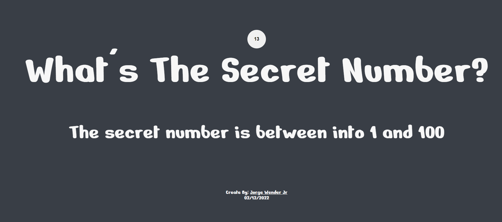

# Secret Number Project

Discovery who is the raffle number until the time is over!

https://secretnumberproject.netlify.app

# What do You need to play?

Only a Microphone and permit the browser to use your microphone.

# What is the project?

This project is a game created only with a vanilla Js

The game raffle a random number and use the microphone to recognize speechers numbers

# How To Play?

1. Permit the browser use your microphone:

2. Select the difficult: Easy , Medium or Hard 

3. Put the min number and max number on gap to be raffle

4. Click on the button: Start The Game

# External Services

Icons: https://fontawesome.com/icons/arrow-up-long?s=solid&f=classic

Page Template Color: https://colorhunt.co/palette/393e466d9886f2e7d5f7f7f7

Web Speech API : https://developer.mozilla.org/en-US/docs/Web/API/Web_Speech_API
